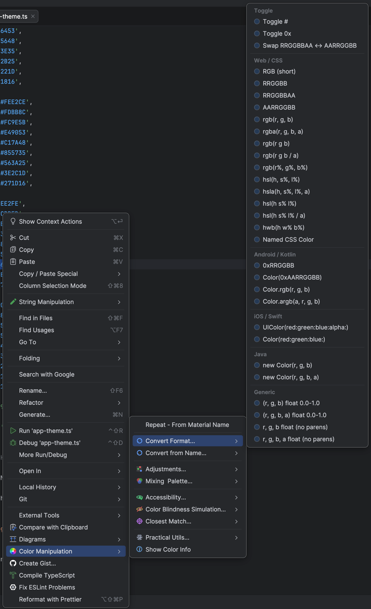

# Color Manipulation

A powerful color toolkit for JetBrains IDEs. Select any color in your code, right-click, and convert, adjust, mix, or analyze it — all without leaving the editor.

Works in **all JetBrains IDEs** (IntelliJ IDEA, WebStorm, Android Studio, PyCharm, GoLand, CLion, Rider, PhpStorm, RubyMine, etc.) with **all file types**.



[](https://github.com/sponsors/ignaciotcrespo)

**Other projects:**
- [GitShelf](https://github.com/ignaciotcrespo/gitshelf) — Changelists and shelves for git in the terminal
- [Vector Drawable Thumbnails](https://github.com/ignaciotcrespo/vector-drawable-thumbnails-plugin) — Thumbnail previews of Android Vector Drawables in JetBrains IDEs

## Installation

- **From JetBrains Marketplace**: Settings > Plugins > Marketplace > Search "Color Manipulation"
- **Manual**: Download the `.zip` from [Releases](https://github.com/ignaciotcrespo/color-manipulation-plugin/releases) > Settings > Plugins > Install Plugin from Disk
- **Keyboard shortcut**: `Ctrl+Alt+C` (`Cmd+Alt+C` on Mac)

## Features

### Convert Format

Convert between **30+ color formats** across all major platforms:

| Platform | Formats |
|---|---|
| **Web / CSS** | `#RGB`, `#RRGGBB`, `#RRGGBBAA`, `#AARRGGBB`, `rgb()`, `rgba()`, `hsl()`, `hsla()`, `hwb()`, Named CSS Colors |
| **Android / Kotlin** | `0xRRGGBB`, `Color(0xAARRGGBB)`, `Color.rgb()`, `Color.argb()` |
| **iOS / Swift** | `UIColor(red:green:blue:alpha:)`, `Color(red:green:blue:)` |
| **Java** | `new Color(r, g, b)`, `new Color(r, g, b, a)` |
| **Generic** | Float RGB/RGBA `(0.0-1.0)`, with and without parentheses |

Also includes **Toggle #**, **Toggle 0x**, and **Swap RRGGBBAA/AARRGGBB** byte order.

### Convert from Name

Convert named colors from popular design systems to hex values:

- **CSS** — `red`, `cornflowerblue`, `darkslategray`, ...
- **Tailwind CSS** — `gray-800`, `blue-500`, `emerald-300`, ...
- **Bootstrap** — `primary`, `danger`, `blue-400`, ...
- **Material Design** — `Blue 500`, `Red 300`, `Deep Purple 700`, ...
- **iOS System** — `systemBlue`, `systemRed`, `systemGray2`, ...

Works on single names or multi-line selections — the plugin scans the text and converts every recognized name.

### Adjustments

| Category | Options |
|---|---|
| **Lighten / Darken** | 5%, 10%, 20%, or custom |
| **Saturate / Desaturate** | 10%, 20%, grayscale, or custom |
| **Adjust Alpha** | 100%, 75%, 50%, 25%, 0%, or custom |
| **Hue Rotate** | +30, +60, +90, +180 degrees, invert, or custom |
| **Temperature** | Warmer / Cooler at 10%, 20%, 40%, or custom |

### Mixing & Palette

- **Tint** — mix with white (10%, 25%, 50%, or custom)
- **Shade** — mix with black (10%, 25%, 50%, or custom)
- **Complementary** — source + 180 degrees hue rotation
- **Analogous** — three colors at -30, 0, +30 degrees
- **Triadic** — three colors at 0, 120, 240 degrees
- **Shades (100-900)** — nine lightness variations

### Accessibility

- **WCAG Contrast Check** — shows contrast ratio against white/black with AA/AAA pass/fail results
- **Auto-fix AA on White/Black** — adjusts lightness to meet 4.5:1 contrast ratio
- **Auto-fix AAA on White/Black** — adjusts lightness to meet 7:1 contrast ratio

### Color Blindness Simulation

Preview how colors appear to people with color vision deficiencies:

- **Protanopia** (red-blind)
- **Deuteranopia** (green-blind)
- **Tritanopia** (blue-blind)

### Closest Match

Find and convert to the nearest color in popular design systems:

- **Named CSS**, **Tailwind**, **Bootstrap**, **Material Design**, **iOS System**
- Two modes: convert to **name** (`cornflowerblue`) or to **value** (`#6495ED`)

### Practical Utils

- **Random Color** — generate a random color
- **Sort Lines** by Hue, Lightness, or Saturation — reorders entire lines by their color
- **Sort Colors** by Hue, Lightness, or Saturation — swaps color values in place
- **Normalize to Same Format** — convert all selected colors to match the first one's format

### Replace with Color

Replace one or many selected colors with a custom color value. A dialog lets you type any color in any supported format — `#FF5733`, `rgb(255, 87, 51)`, `hsl(11, 100%, 60%)`, `red`, or any other format the plugin recognizes. As you type, a live preview swatch shows the color and a label confirms the detected format.

Each replaced occurrence keeps its original format: if you enter `#FF0000` and the codebase has `rgb(...)` and `hsl(...)` entries, they become `rgb(255, 0, 0)` and `hsl(0, 100%, 50%)` respectively.

Available in both the **editor right-click menu** and the **palette context menu**.

### Show Color Info

Popup with all format conversions, HSL values, alpha, WCAG contrast ratios with colored pass/fail badges, suggested AA-compliant color with visual swatch preview, and closest matches across CSS, Tailwind, Bootstrap, Material Design, and iOS design systems.

### Project Color Palette

A dedicated **side panel** (Tool Window) that scans your entire project and gives you a bird's-eye view of every color in your codebase. Open it from **View > Tool Windows > Color Palette**, or from the right sidebar.

#### How it works

Click **Analyze Project** to scan all source files. The plugin finds every color occurrence across 40+ file types — CSS, HTML, JavaScript, TypeScript, Kotlin, Swift, Java, Python, Go, Rust, and more — while automatically skipping build directories, node_modules, and test files.

Results appear in a tree view organized by frequency (most used first) or by hue. Each node shows a color swatch, the color value, occurrence count, and file count.

#### Palette features

| Feature | Description |
|---|---|
| **Tree view** | Colors grouped by frequency or hue, with swatches and counts |
| **Similar colors** | Groups visually similar colors that could be unified |
| **Format inconsistencies** | Highlights the same color written in different formats |
| **WCAG contrast badges** | Inline AAA/AA/Fail indicators on every color node |
| **Rich tooltips** | Hover for all format conversions and WCAG contrast ratios |
| **Color Info popup** | Full details with pass/fail badges, AA fix suggestion with swatch preview, and closest matches in 5 design systems |
| **Click-to-navigate** | Click any occurrence to jump to the exact line and column |
| **Context menu** | Right-click for the same transforms as the editor menu — convert format, adjustments, mixing, accessibility, color blindness simulation |
| **Replace with Color** | Batch-replace selected colors or groups with a custom value |
| **Display format** | View colors in #RRGGBB, rgb(), hsl(), 0x, Color(), or UIColor() |
| **File filter** | Narrow scans to specific patterns (e.g. `*.tsx`, `*.css`) |
| **State preservation** | Expanded nodes, selection, and scroll position survive re-scans |

### Repeat Last Action

Quickly re-apply any previous transform — including custom dialog values. Appears at the top of the menu after the first action.

## Multi-cursor & Embedded Colors

- **Multi-cursor**: select multiple colors individually and transform them all at once
- **Embedded colors**: select a block of text and the plugin finds all colors inside and transforms them
- **Live preview icons**: see the resulting color in the menu before clicking

## Building from Source

```bash
# Build
./gradlew buildPlugin

# Run in a sandboxed IDE
./gradlew runIde

# Verify plugin compatibility
./gradlew verifyPlugin
```

The plugin zip will be at `build/distributions/`.

## Contributing

Contributions are welcome. Please open an issue first to discuss what you'd like to change.

The architecture is data-driven — adding a new color preset is a single line of code:

```kotlin
ActionEntry.Transform("Lighten 7%") { c, _ -> ColorTransforms.lighten(c, 7.0) }
```

Adding a new category is one definition file + one line in `ColorManipulationGroup`.

## Inspiration

This plugin was inspired by the excellent [String Manipulation](https://plugins.jetbrains.com/plugin/2162-string-manipulation) plugin by Vojtech Krasa. I used it daily and at some point thought: "I need something like this to easily change the colors in the code" So I built it.

## License

[MIT License](LICENSE)
